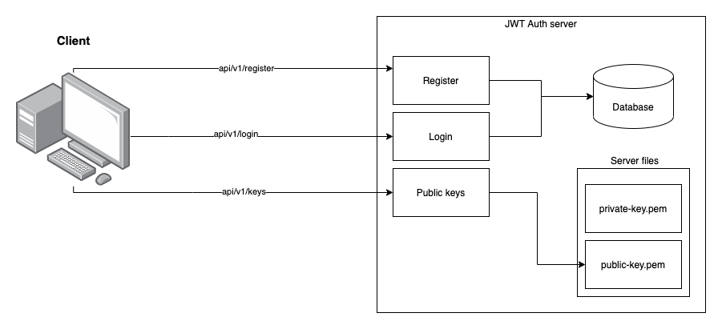

# JWT Auth server

## Structure

An auth server to use in my other projects



We have 3 endpoints:

- api/v1/register - it's used to register a new user to the database;
- api/v1/login - return a valid jwt token for the user;
- api/v1/keys - return the server public keys that could be used to validate the token.

## How to run

### Locally

Create a .env file with the following content:

```
PORT=:3000
ENV=dev
AUD=your_aud
ISS=your_iss
APP_DB_USERNAME=your_db_user_name
APP_DB_PASSWORD=your_db_password
APP_DB_HOST=your_db_host
APP_DB_NAME=your_db_name
```

After that, you can run the following command on you terminal:

```
go run main.go app.go wire_gen.go
```

### Docker

If you prefer to run a docker image you can update the file docker-compose.yaml with your ENVIRONMENT variables and then
run the following command:

```
docker-compose up -d
```
